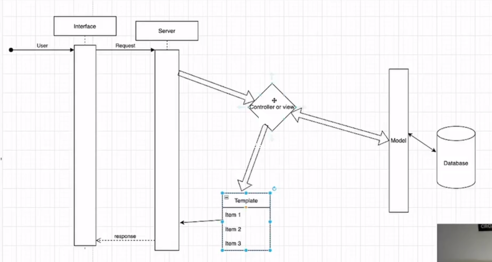

### Framework:
- Framwork provides with boilerplate code. Analogy to a framework is already made flat having tap water, geyser, electricity connections, etc.
- Boilerplate code is the code that is already existing. It is already present to tackle some commonly occuring problems.
- Example - Ease with database connectivity, easy handling of request response cycle, help with user authentication.
- A framework can also be manipulated but should be done by an expert.
### Library:
- These are the astract code that a framework keeps to expose it's functionality via an API.
### API:
- Application programming interface. Provides an interface for a user to use.
- It lets a user use the functionalities of a framework, kept as library, in a controlled manner.
- Easy example for an API would be, an exposed public method, that has multiple private methods hidden from user.
### MVT
- Django is a Model, View and Template framework.
- Model keeps data to interact with database.
- View is where business logic is kept.
- Template is the interface a user looks at.

- In many other frameworks, Template is referred as View and View is referred as Controller.

### Localhost and Port
- Localhost is IP address of own computer. It is 127.0.0.1, which refers to the current machine.
- Port number is assigned for specific type of communication we are doing.
- Ex- Port 80 in case of web traffic. Port 443 in case of secure web traffic (HTTPS).
